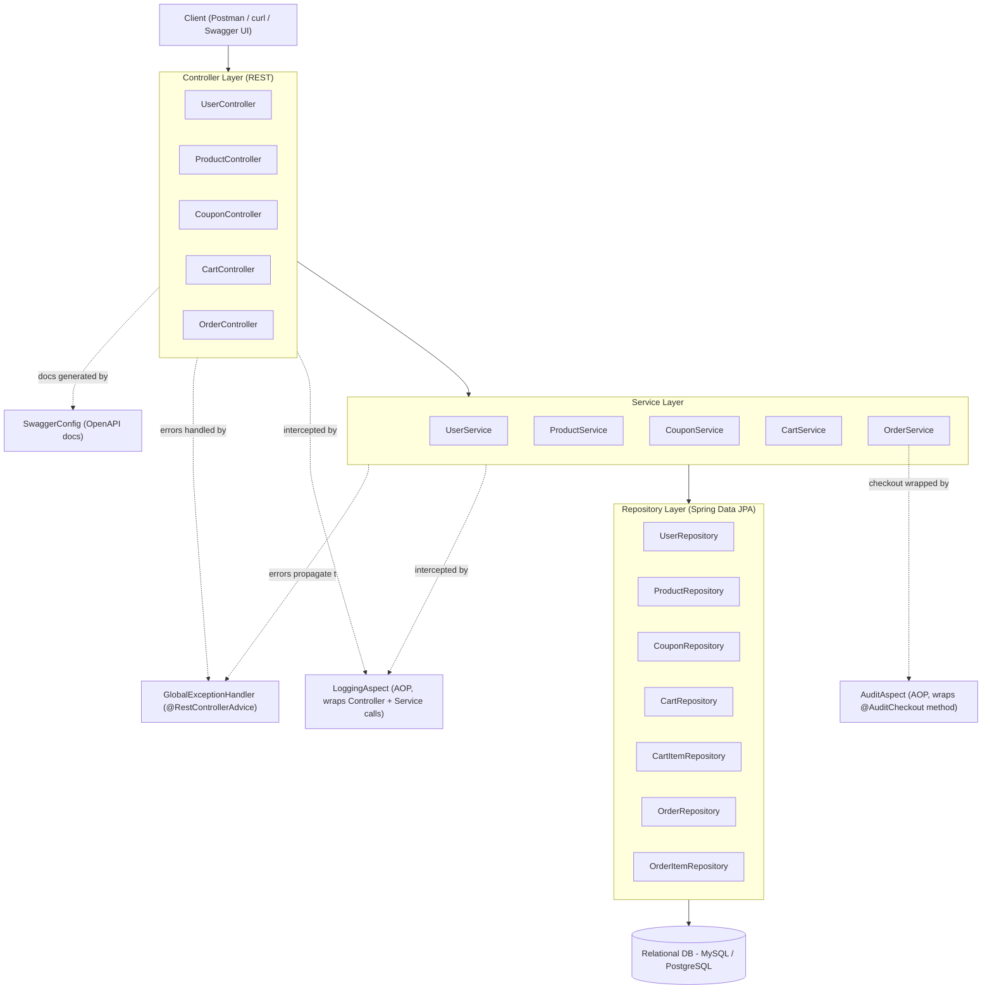
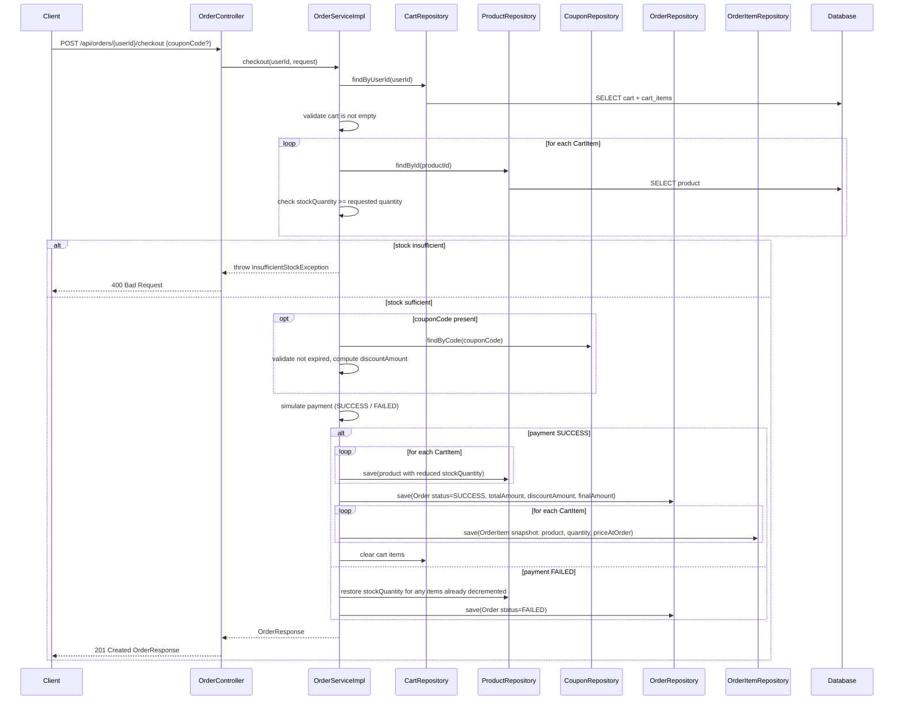

# Architecture & Module Flow

## Layered Architecture

The application follows a standard layered Spring Boot architecture, with a cross-cutting AOP layer for logging/auditing and a centralized handler for exceptions:

## Request Flow Example: Checkout

This is the most involved flow in the system, so it's worth tracing end-to-end:

The entire `checkout()` method is wrapped in `@Transactional`, so if any step fails partway through (e.g. the order save fails after stock was already decremented), the whole operation — including the stock change — rolls back automatically. The `@AuditCheckout` annotation on this method additionally triggers `AuditAspect`, which logs the attempt, success (with order ID and final amount), or failure (with the reason) independently of the transactional rollback.

## Module Responsibilities

| Module | Responsibility |
|---|---|
| `controller` | Translates HTTP requests/responses, delegates to services, returns `ResponseEntity<DTO>` with proper status codes |
| `service` | Core business rules: stock validation, coupon discount calculation, payment simulation, inventory adjustment |
| `repository` | Data access via Spring Data JPA — CRUD plus lookups needed for stock checks, coupon validation, and paginated order history |
| `entity` | JPA-mapped domain model (`User`, `Product`, `Cart`, `CartItem`, `Order`, `OrderItem`, `Coupon`) plus the shared `Auditable` base class |
| `dto.request` / `dto.response` | Decouple the public API contract from the internal entity model; response DTOs flatten entity graphs (e.g. `OrderResponse` embeds `List<OrderItemResponse>`) |
| `exception` | Domain exceptions (e.g. insufficient stock, resource not found) plus `GlobalExceptionHandler` translating them into consistent HTTP error responses |
| `aop` | Cross-cutting method-level logging (`LoggingAspect`) and checkout-specific outcome auditing (`AuditAspect` + `@AuditCheckout`) |
| `config` | `SwaggerConfig` for OpenAPI docs, `@EnableJpaAuditing` for automatic `createdAt`/`updatedAt` stamping |

## Concurrency & Data Integrity

- **`@Transactional` on `checkout()`** ensures stock validation, inventory reduction, order/order-item creation, and cart clearing either all commit together or all roll back together.
- **Auditing via `Auditable`** (`@CreatedDate`/`@LastModifiedDate` + `@EnableJpaAuditing`) stamps `createdAt`/`updatedAt` automatically, with no manual timestamp-setting code in any service method.
- **Potential race condition to be aware of**: two concurrent checkouts for the same product near its last unit of stock could both pass the "stock available" read-check before either commits its decrement, resulting in oversold inventory. This is a known gap in a transactional-only design. If the evaluator probes for this, the fix is either:
  - **Optimistic locking** — add `@Version` to `Product`, so a concurrent update fails fast with an `OptimisticLockException`, or
  - **Pessimistic locking** — add `@Lock(LockModeType.PESSIMISTIC_WRITE)` to the stock-check query in `ProductRepository`, so a second transaction blocks until the first one commits or rolls back.
- **Validation annotations** (`@NotBlank`, `@Min`, `@NotNull` on entities/DTOs) provide a first line of defense against invalid data reaching the database layer, ahead of any business-rule checks in the service.

## Module Flow Summary (Functional Requirements → Implementation)

| Functional Requirement | Where it's implemented |
|---|---|
| Add product to cart | `CartController.addToCart` (`POST /api/cart/{userId}/add`) → `CartService.addToCart` |
| Update quantity in cart | `CartController.updateCartItem` (`PUT /api/cart/{userId}/item/{cartItemId}`) → `CartService.updateCartItem` |
| Remove product from cart | `CartController.removeFromCart` (`DELETE /api/cart/{userId}/item/{cartItemId}`) → `CartService.removeFromCart` |
| View cart with total price | `CartController.getCart` (`GET /api/cart/{userId}`) → `CartResponse.totalAmount`, summed from `CartItemResponse.subtotal` |
| Apply discount coupon | Applied at checkout time via `CheckoutRequest.couponCode`, persisted on `Order.couponCode` / `Order.discountAmount` (see note below) |
| Validate stock before checkout | `OrderService.checkout` — stock check against `ProductRepository` before order creation |
| Create order from cart items | `OrderService.checkout` → `Order` + `OrderItem` rows persisted via `OrderRepository` / `OrderItemRepository` |
| Simulate payment (SUCCESS/FAILED) | `OrderService.checkout` — outcome reflected in `OrderResponse.status` (`OrderStatus` enum) |
| Reduce inventory on success | `OrderService.checkout` — `ProductRepository.save()` with decremented `stockQuantity` |
| Restore inventory on failure | `OrderService.checkout` — reverts any stock already decremented, all within the same `@Transactional` boundary |
| Generate order summary with order ID | `OrderResponse` (`orderId`, `items`, `totalAmount`, `discountAmount`, `finalAmount`, `status`, `createdAt`, `updatedAt`) |
| Fetch order history by user ID | `OrderController.getOrdersByUser` / `getOrdersByUserAndStatus` — paginated, sorted by `createdAt` descending |

> **Note on assumptions**: This document is based on the controllers, entities, and DTOs shared so far (`UserController`, `CouponController`, `CartController`, `OrderController`, and the entity/DTO classes). The actual `*ServiceImpl` classes, `ProductController`, `CheckoutRequest`, and `GlobalExceptionHandler` haven't been shared yet, so their internals are inferred from the spec and surrounding code rather than confirmed directly. If you share those, I can tighten this document to match the real implementation exactly — in particular, confirming whether coupon discounts are applied at checkout (as assumed here) or via a separate cart endpoint.
